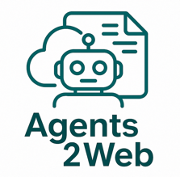

# A2WF — Agent-to-Web Framework

<p align="center">
  
</p>

<p align="center">
  <a href="https://a2wf.org/specification/"></a>
  <a href="https://schema.org"></a>
  <a href="https://github.com/a2wf/spec/blob/main/LICENSE"></a>
  <a href="https://a2wf.org/convert/"></a>
</p>

<p align="center">
  <strong>The open standard for AI agent governance on websites.</strong>
</p>

<p align="center">
  <a href="https://a2wf.org">Website</a> ·
  <a href="https://a2wf.org/specification/">Specification</a> ·
  <a href="https://a2wf.org/documentation/">Documentation</a> ·
  <a href="https://a2wf.org/examples/">Examples</a>
</p>

---

## What is A2WF?

A2WF (Agent-to-Web Framework) provides a standardized, machine-readable way for website operators to publish a `siteai.json` policy for AI agents.

It answers questions like:
- What may agents read?
- What may agents do?
- What requires human verification?
- What data is off-limits?
- How should agents identify themselves?
- Which legal / compliance rules apply?

A2WF complements existing standards like `robots.txt`, `sitemap.xml`, `llms.txt`, MCP, A2A, and in-page Schema.org markup.

## Core Principle

A2WF is about **site governance**, not website navigation.

- `robots.txt` controls crawling
- `sitemap.xml` lists URLs
- `Schema.org` describes entities on pages
- `siteai.json` defines **what AI agents are allowed to do on the site**

## Quick Start

Create `/siteai.json` on your website root:

```json
{
  "@context": "https://schema.org",
  "specVersion": "1.0",
  "identity": {
    "@type": "WebSite",
    "domain": "https://www.example-store.com",
    "name": "Example Online Store",
    "description": "Premium widgets and gadgets",
    "purpose": "E-commerce store selling premium widgets to EU consumers.",
    "inLanguage": "en",
    "category": "e-commerce",
    "jurisdiction": "EU",
    "contact": "ai-policy@example-store.com"
  },
  "defaults": {
    "agentAccess": "restricted",
    "requireIdentification": true,
    "maxRequestsPerMinute": 30,
    "respectRobotsTxt": true
  },
  "permissions": {
    "read": {
      "productCatalog": { "allowed": true, "rateLimit": 60 },
      "pricing": { "allowed": true },
      "availability": { "allowed": true, "rateLimit": 30 },
      "faq": { "allowed": true }
    },
    "action": {
      "search": { "allowed": true, "rateLimit": 20 },
      "addToCart": { "allowed": true },
      "checkout": {
        "allowed": true,
        "humanVerification": true,
        "note": "Final purchase requires human confirmation."
      },
      "createAccount": { "allowed": false },
      "submitReview": { "allowed": false }
    },
    "data": {
      "customerRecords": { "allowed": false },
      "paymentInfo": { "allowed": false },
      "internalAnalytics": { "allowed": false }
    }
  },
  "scraping": {
    "bulkDataExtraction": false,
    "priceMonitoring": false,
    "contentReproduction": false,
    "trainingDataUsage": false
  },
  "agentIdentification": {
    "requireUserAgent": true,
    "requiredFields": ["agentName", "agentOperator"],
    "allowAnonymousAgents": false
  },
  "humanVerification": {
    "methods": ["redirect-to-browser"],
    "requiredFor": ["checkout"]
  },
  "discovery": {
    "robotsTxt": "https://www.example-store.com/robots.txt",
    "llmsTxt": "https://www.example-store.com/llms.txt",
    "schemaOrg": true
  },
  "legal": {
    "termsUrl": "https://www.example-store.com/legal/ai-terms",
    "euAiActCompliance": {
      "transparencyRequired": true,
      "riskClassification": "limited",
      "humanOversightMandatory": false
    }
  },
  "metadata": {
    "author": "Example Store Legal Team",
    "lastUpdated": "2026-03-18"
  }
}
```

## Discovery Order

Agents should attempt discovery in this order:
1. `https://example.com/siteai.json`
2. `robots.txt` with `SiteAI:` directive
3. HTML `<link rel="siteai">`
4. `/.well-known/siteai.json`

## Specification Status

**Current version:** 1.0 (Core Proposed Standard)

The current public core specification is in [`spec/specification-v1.0.md`](./spec/specification-v1.0.md).

## Core vs Extensions

The current repository focuses on the **core governance layer**.

Core fields include:
- `@context`
- `specVersion`
- `identity`
- `defaults`
- `permissions`
- `scraping`
- `agentIdentification`
- `humanVerification`
- `discovery`
- `legal`
- `metadata`

Optional site description extensions such as `keySections`, `publisher`, `company`, `services`, `forms`, `apiEndpoints`, or `alternateVersions` are treated separately from the core governance model.

## Examples

See the [`examples/`](./examples) directory for industry-specific `siteai.json` examples:

- 🛒 [E-Commerce](./examples/ecommerce.json)
- 🏥 [Healthcare](./examples/healthcare.json)
- 🍽️ [Restaurant](./examples/restaurant.json)
- 🏦 [Banking](./examples/banking.json)
- 📰 [News & Media](./examples/news-media.json)

## Contributing

We welcome contributions. Please see [CONTRIBUTING.md](./CONTRIBUTING.md).

Priority areas:
- spec review
- legal review
- implementation feedback
- validators / generators / plugins
- additional industry examples

## License

MIT License — see [LICENSE](./LICENSE) for details.

---

<p align="center">
  <sub>Created by <a href="https://ssc-slovakia.com">SSC Software Sales Consulting</a></sub>
</p>
